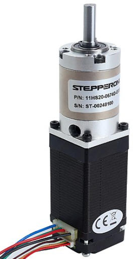
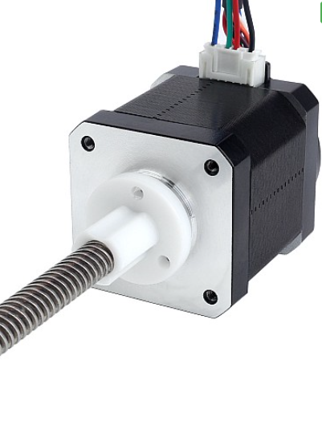
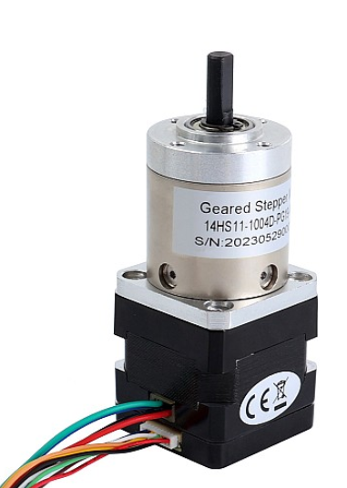

# Joint Specifications

## Table A.5: Stepper 5 Specs
<table>
  <tr>
    <th style="background-color:#CCCCCC;">Property</th>
    <th style="background-color:#CCCCCC;">Specification</th>
    <th rowspan="7" style="text-align:center;"></th>
  </tr>
  <tr><td>Joint</td><td>Wrist rotation</td></tr>
  <tr><td>Model</td><td>11HS20-0674D-EGS16-AR4</td></tr>
  <tr><td>Weight</td><td>320 g</td></tr>
  <tr><td>Gear Ratio</td><td>16:1</td></tr>
  <tr><td>Max Permissible Torque</td><td>4 Nm</td></tr>
  <tr><td>Moment Permissible Torque</td><td>8 Nm</td></tr>
  <tr><td>Standard</td><td>NEMA 11</td></tr>
</table>

<b>Figure A.5:</b> Stepper 5 specifications including properties, values, and an image of the stepper.

## Table A.6: Stepper 6 Specs
<table>
  <tr>
    <th style="background-color:#CCCCCC;">Property</th>
    <th style="background-color:#CCCCCC;">Specification</th>
    <th rowspan="7"></th>
  </tr>
  <tr><td>Joint</td><td>Wrist up/down</td></tr>
  <tr><td>Model</td><td>17LS19-1684E-200G-AR4</td></tr>
  <tr><td>Weight</td><td>405 g</td></tr>
  <tr><td>Gear Ratio</td><td>0</td></tr>
  <tr><td>Max Permissible Torque</td><td>—–</td></tr>
  <tr><td>Moment Permissible Torque</td><td>—–</td></tr>
  <tr><td>Standard</td><td>NEMA 17</td></tr>
</table>

<b>Figure A.6:</b> Stepper 6 specifications including properties, values, and an image of the stepper.

## Table A.7: Stepper 7 Specs
<table>
  <tr>
    <th style="background-color:#CCCCCC;">Property</th>
    <th style="background-color:#CCCCCC;">Specification</th>
    <th rowspan="7"></th>
  </tr>
  <tr><td>Joint</td><td>Flange rotation</td></tr>
  <tr><td>Model</td><td>14HS11-1004D-PG19-AR4</td></tr>
  <tr><td>Weight</td><td>269 g</td></tr>
  <tr><td>Gear Ratio</td><td>19 + 38/187:1</td></tr>
  <tr><td>Max Permissible Torque</td><td>3 Nm</td></tr>
  <tr><td>Moment Permissible Torque</td><td>5 Nm</td></tr>
  <tr><td>Standard</td><td>NEMA 14</td></tr>
</table>

<b>Figure A.7:</b> Stepper 7 specifications including properties, values, and an image of the stepper.

