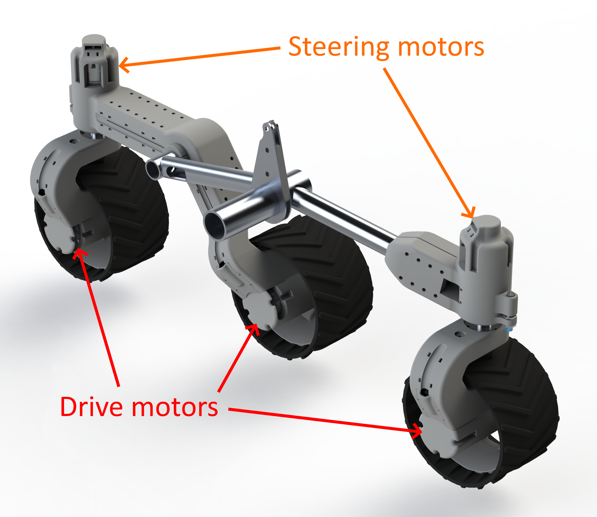
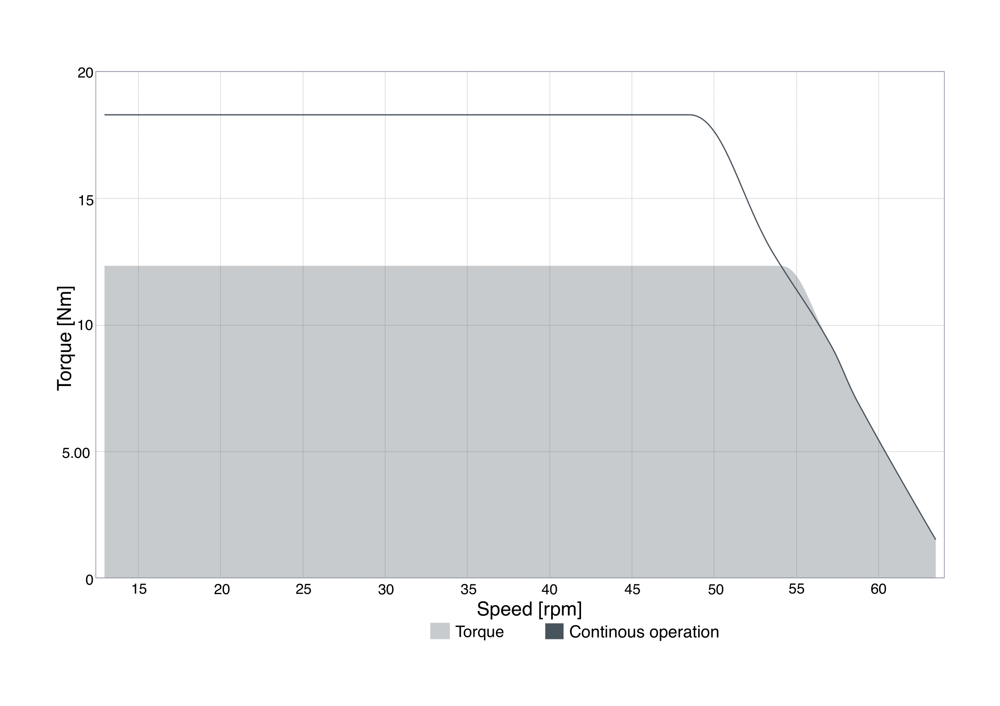
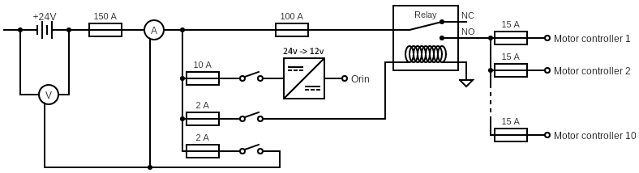

# AAU Rover: Electrical Design Overview

The AAU Rover is an innovative mobile platform designed for challenging environments. This document summarizes its key electrical design features and specifications.

---

## Motors and Steering
- **Propulsion**: Individual motors for each of the six wheels.
- **Steering**: Motors control the angle of the two front and rear wheels.
- **Power Supply**: A single 24V, 50Ah battery powers all motors via motor controllers.

  
  

### Motor Details
- **Type**: Nanotec DB59 with 1:62 high torque planetary gearbox.
- **Steering**: Position-controlled using encoders.
- **Driving**: Velocity-controlled using built-in hall sensors.

---

## Power and Wiring
- **System Voltage**: 24V for optimal performance and reduced cable size.
- **Protection**: Individual fuses for all components and short-circuit protection.
- **Monitoring**: Volt and amp meters to track system voltage and power draw.
- **Switching**: Relay-controlled power distribution to all motor controllers.

---

## Key Specifications
| Specification       | Value         |
|---------------------|---------------|
| **Max speed**       | 2.11 km/h     |
| **Rover weight**    | 43 kg         |
| **Carrying capacity** | 30 kg       |
| **Wheel diameter**  | 20 cm         |

asd

---
